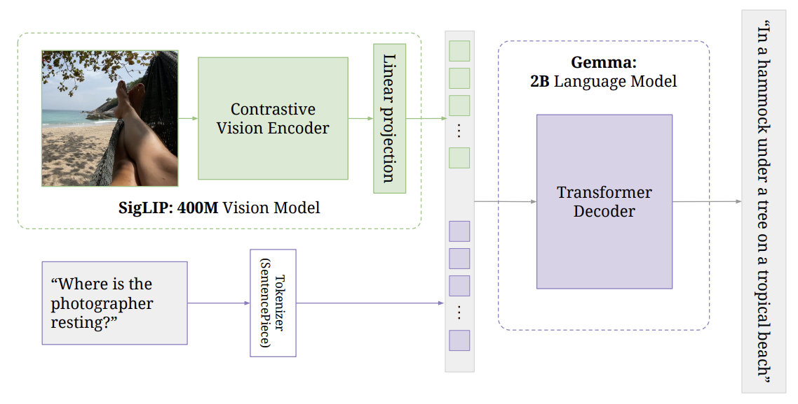

# Multimodal LLM from Scratch

[](https://pytorch.org/)

An educational implementation of a multimodal language model combining vision and text capabilities, built from fundamental components.



## Features
- **Dual Modality Processing** - Handles both images and text inputs
- **Vision Encoder** - SigLIP-based image understanding
- **Language Model** - Gemma variant for text generation
- **Efficient Inference** - Optimized for single GPU usage

## Installation

### Prerequisites
- Python 3.10+
- PyTorch 2.0+
- CUDA or MPS support (for faster inference)

```
git clone https://github.com/akshaykumar46/Multimodal_LLM_from_scratch
cd Multimodal_LLM_from_scratch
```
### Install dependencies
```pip install -r requirements.txt ```
### Download pretrained weights
```chmod +x download_weights.sh
./download_weights.sh```


## Quick Start

### Basic Inference
```
MODEL_PATH="/paligemma_weight_loc"
PROMPT="prompt"
IMAGE_FILE_PATH="image.jpg"
MAX_TOKENS_TO_GENERATE=50
TEMPERATURE=0.8
TOP_P=0.9
DO_SAMPLE="True"
ONLY_CPU="False"
```
```
python inference.py \
	--model_path "$MODEL_PATH" \
	--prompt "$PROMPT" \
	--image_file_path "$IMAGE_FILE_PATH" \
	--max_tokens_to_generate "$MAX_TOKENS_TO_GENERATE" \
	--temperature "$TEMPERATURE" \
	--top_p "$TOP_P" \
	--do_sample "$DO_SAMPLE" \
	--only_cpu "$ONLY_CPU" \
```
